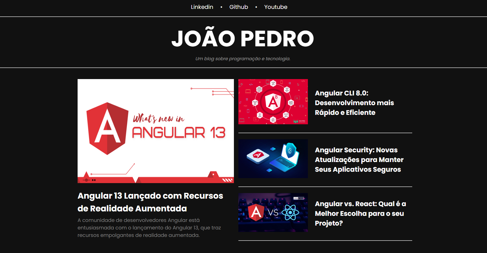

# Blog de Programação e Tecnologia

Este é o repositório do código-fonte para o Blog de Programação e Tecnologia desenvolvido em Angular. O projeto tem como objetivo fornecer um espaço para compartilhar notícias, tutoriais e insights relacionados à programação, tecnologia e desenvolvimento web.

{width=200px}

## Funcionalidades Principais

- Exibição de notícias e artigos relacionados à programação e tecnologia.
- Páginas detalhadas para cada postagem com conteúdo completo.
- Navegação fácil e intuitiva por categorias.
- Rodapé informativo com links úteis e informações de contato.

## Tecnologias Utilizadas

- [Angular](https://angular.io/): Um framework de desenvolvimento front-end poderoso.
- [HTML5](https://developer.mozilla.org/en-US/docs/Web/Guide/HTML/HTML5): A linguagem de marcação para estruturar e apresentar o conteúdo da web.
- [CSS3](https://developer.mozilla.org/en-US/docs/Web/CSS): A linguagem de estilo para a aparência e formatação de páginas web.
- [TypeScript](https://www.typescriptlang.org/): Uma linguagem de programação superset do JavaScript usada no desenvolvimento Angular.

## Instalação

1. Clone este repositório em sua máquina local usando `git clone`.

```bash
git clone https://github.com/seu-usuario/blog-angular.git
```

2. Instale as dependências usando o npm (Node Package Manager).

```bash
npm install
```

3. Inicie o servidor de desenvolvimento.

```bash
ng serve
```

Acesse o blog em http://localhost:4200/ em seu navegador.

## Contribuição

Se você deseja contribuir para este projeto, fique à vontade para abrir problemas (issues) ou enviar solicitações de pull (pull requests). Sua contribuição é bem-vinda!
